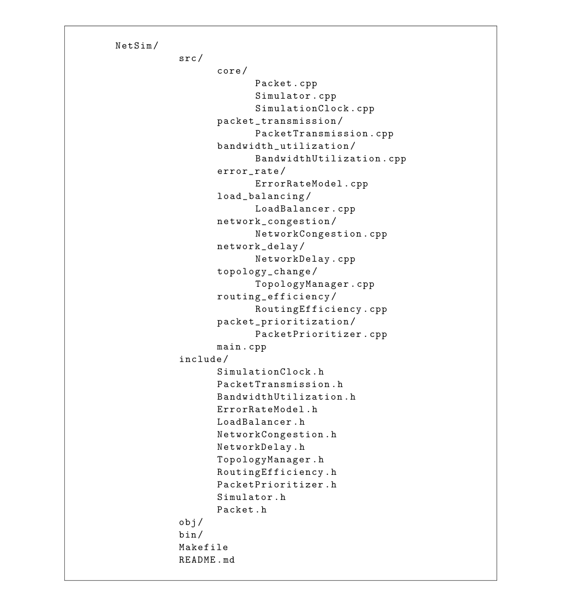

# NetSim - Network Simulator

## Overview

NetSim is a comprehensive C++ network simulation project designed to model and analyze various aspects of network behavior. It provides a modular and extensible framework for simulating complex network scenarios, including packet transmission, bandwidth utilization, error rates, load balancing, congestion, delays, topology changes, and routing efficiency.

- 💻 [Source Code](src/)

- 📚 

